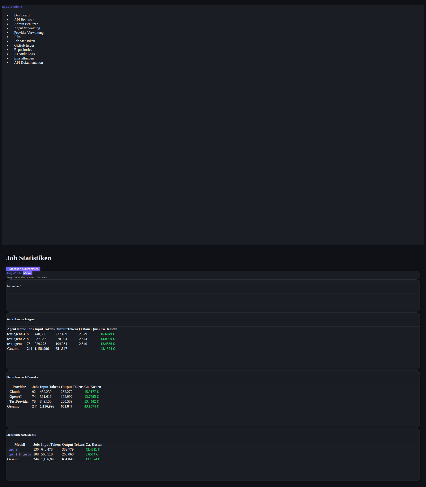

# Job Statistics Feature Documentation

## Overview

The Job Statistics feature provides comprehensive analytics for job execution in KIGate, allowing administrators to track usage patterns, costs, and performance metrics across different dimensions (agents, providers, and models) over time.

## Features

### 1. Multi-Dimensional Statistics

The system calculates and displays statistics aggregated by:

- **Agent Name**: Track performance and costs for individual agents
  - Job count
  - Total input/output tokens
  - Average duration (in milliseconds)
  - Estimated costs

- **Provider**: Monitor usage across different AI providers (OpenAI, Claude, Gemini, etc.)
  - Job count
  - Total input/output tokens
  - Estimated costs

- **Model**: Analyze costs and usage by AI model
  - Job count
  - Total input/output tokens
  - Estimated costs

### 2. Time-Based Aggregation

Statistics are calculated and stored at three temporal levels:

- **Daily**: Data for the last 30 days
- **Weekly**: Data for the last 12 weeks
- **Monthly**: Data for the last 12 months

### 3. Visual Analytics

The statistics page includes interactive charts powered by Chart.js:

- **Time Series Chart**: Shows job counts and costs over time with dual Y-axes
- **Agent Cost Bar Chart**: Displays the top 10 agents by cost
- **Provider Distribution Doughnut Chart**: Visualizes cost distribution across providers
- **Model Cost Bar Chart**: Shows the top 10 models by cost

### 4. Manual Refresh

Administrators can manually trigger a statistics recalculation through the UI with the "Statistiken aktualisieren" button. This will:
- Recalculate all daily, weekly, and monthly statistics
- Update the database with fresh data
- Display the number of records created

### 5. Automated Updates via CLI

A command-line script is provided for automated statistics updates via cron jobs.

## Installation & Setup

### Database

The `job_statistics` table is automatically created during database initialization. No manual migration is required.

### Accessing Statistics

Navigate to: `http://your-server:8000/admin/job-statistics`

Authentication required: Admin credentials

## CLI Script for Cron Jobs

### Script Location

`cli_update_statistics.py` - Located in the root directory of the project

### Usage

```bash
python cli_update_statistics.py
```

### Cron Job Setup

To run the statistics update daily at 1:00 AM:

```bash
# Edit crontab
crontab -e

# Add this line (adjust paths as needed)
0 1 * * * cd /path/to/KIGate && /usr/bin/python3 cli_update_statistics.py >> /var/log/kigate_stats.log 2>&1
```

### Script Output

The script logs:
- Start and end timestamps
- Number of records created (daily, weekly, monthly)
- Execution duration
- Success/failure status

Example output:
```
2025-11-11 15:41:20 - __main__ - INFO - KIGate Job Statistics Update Script
2025-11-11 15:41:20 - __main__ - INFO - Started at: 2025-11-11 15:41:20
2025-11-11 15:41:20 - __main__ - INFO - Statistics update completed successfully:
2025-11-11 15:41:20 - __main__ - INFO -   - Daily statistics: 173 records
2025-11-11 15:41:20 - __main__ - INFO -   - Weekly statistics: 96 records
2025-11-11 15:41:20 - __main__ - INFO -   - Monthly statistics: 24 records
2025-11-11 15:41:20 - __main__ - INFO - Duration: 0.21 seconds
2025-11-11 15:41:20 - __main__ - INFO - Status: SUCCESS
```

## API Endpoints

### View Statistics Page

```
GET /admin/job-statistics?period={day|week|month}
```

**Parameters:**
- `period` (optional): Time period for statistics. Values: `day`, `week`, `month`. Default: `month`

**Authentication:** HTTP Basic Auth with admin credentials

**Response:** HTML page with statistics and charts

### Refresh Statistics

```
POST /admin/job-statistics/refresh
```

**Authentication:** HTTP Basic Auth with admin credentials

**Response:**
```json
{
  "success": true,
  "message": "Statistiken erfolgreich aktualisiert",
  "counts": {
    "day": 173,
    "week": 96,
    "month": 24
  }
}
```

## Database Schema

### job_statistics Table

| Column | Type | Description |
|--------|------|-------------|
| id | VARCHAR(36) | Primary key (UUID) |
| period_type | VARCHAR(10) | Type of period: 'day', 'week', or 'month' |
| period_start | DATETIME | Start of the period (timezone-aware) |
| period_end | DATETIME | End of the period (timezone-aware) |
| agent_name | VARCHAR(200) | Agent name (NULL for non-agent aggregations) |
| provider | VARCHAR(50) | Provider name (NULL for non-provider aggregations) |
| model | VARCHAR(100) | Model name (NULL for non-model aggregations) |
| job_count | INTEGER | Number of jobs in this aggregation |
| total_input_tokens | INTEGER | Sum of input tokens |
| total_output_tokens | INTEGER | Sum of output tokens |
| total_cost | FLOAT | Calculated total cost in EUR |
| avg_duration | FLOAT | Average job duration in milliseconds |
| calculated_at | DATETIME | When this statistic was calculated |

**Indexes:**
- `idx_period_type_start`: On (period_type, period_start)
- `idx_agent_name`: On (agent_name)
- `idx_provider`: On (provider)
- `idx_model`: On (model)

## Cost Calculation

Costs are calculated based on the pricing information stored in the `provider_models` table:

```
Input Cost = (input_tokens / 1,000,000) × input_price_per_million
Output Cost = (output_tokens / 1,000,000) × output_price_per_million
Total Cost = Input Cost + Output Cost
```

If pricing information is not available for a model, the cost is displayed as 0.00 or shown as unavailable.

## Navigation

The statistics page is accessible from the admin panel sidebar:

**Job Statistiken** (with bar chart icon)

Located between "Jobs" and "GitHub Issues" in the navigation menu.

## Technical Implementation

### Service Layer

`service/job_statistics_service.py` - Contains all statistics calculation logic:

- `calculate_statistics_for_period()`: Calculates statistics for a specific time period
- `calculate_all_statistics()`: Calculates statistics for all periods
- `get_statistics_by_agent()`: Retrieves aggregated agent statistics
- `get_statistics_by_provider()`: Retrieves aggregated provider statistics
- `get_statistics_by_model()`: Retrieves aggregated model statistics
- `get_time_series_data()`: Retrieves time series data for charts

### Model Layer

`model/job_statistics.py` - Defines:

- `JobStatistics`: SQLAlchemy model for the database table
- `JobStatisticsResponse`: Pydantic model for API responses
- `JobStatisticsSummary`: Pydantic model for aggregated summaries

### UI Template

`templates/job_statistics.html` - Responsive Bootstrap template with:

- Period selection buttons (day/week/month)
- Statistics tables with sortable columns
- Interactive Chart.js visualizations
- Manual refresh button

## Performance Considerations

1. **Pre-aggregation**: Statistics are pre-calculated and stored, avoiding expensive on-the-fly calculations
2. **Indexed Queries**: Database indexes on key columns ensure fast retrieval
3. **Batch Processing**: The CLI script processes all periods in a single run
4. **Incremental Updates**: Old statistics are deleted and recalculated for each period

## Troubleshooting

### No Statistics Displayed

**Cause**: Statistics haven't been calculated yet

**Solution**: Click the "Statistiken aktualisieren" button or run the CLI script

### Missing Cost Data

**Cause**: Pricing information not configured for models

**Solution**: Add pricing data to provider models in the Provider Management section

### CLI Script Fails

**Possible causes**:
- Database connection issues
- Missing dependencies
- Permission problems

**Solution**: Check the log output for specific error messages

## Future Enhancements

Potential improvements for future versions:

1. Export statistics to CSV/Excel
2. Email reports on schedule
3. Custom date range selection
4. Real-time statistics updates
5. Cost budgeting and alerts
6. Comparative analysis across time periods
7. User-specific statistics (not just agent-level)
8. API endpoints for programmatic access to statistics data

## Screenshot



The screenshot shows:
- Time series chart with dual axes (jobs and costs)
- Agent statistics table with totals
- Provider distribution pie chart
- Model cost bar chart
- Period selection buttons (Day/Week/Month)
- Manual refresh button
